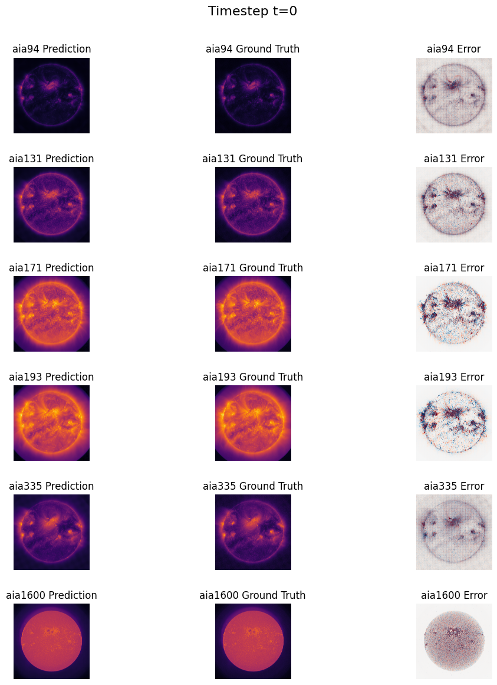
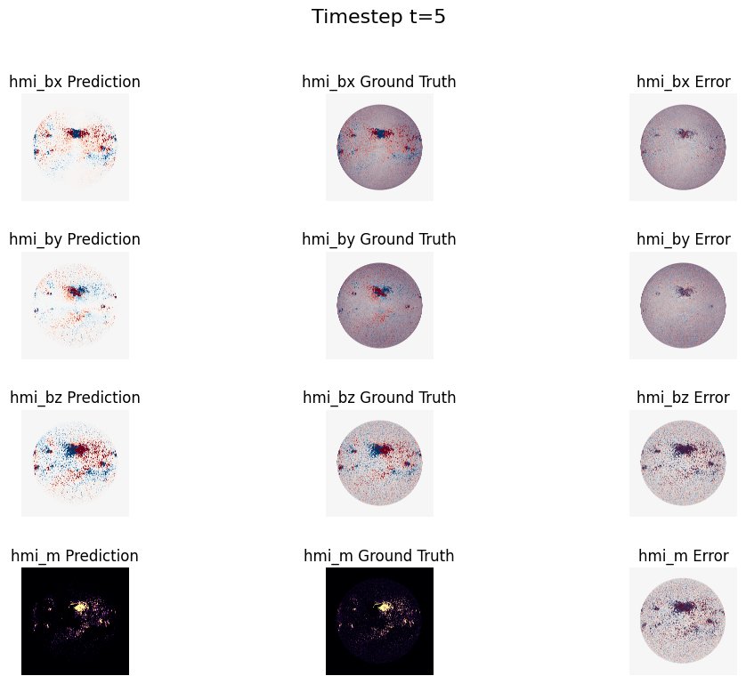

```markdown
# Surya Zero-Shot Inference Analysis
```

---

### Overview

```markdown
This experiment runs zero-shot inference using NASA's Surya solar physics model and analyzes predicted outputs against ground truth data across multiple channels.

The goal is to evaluate how well the model generalizes without fine-tuning by comparing spatial predictions and error distributions.
```

---

### What I Did

```markdown
- Loaded multi-channel prediction dataset (~10GB) using xarray
- Extracted per-channel predictions and corresponding ground truth
- Visualized outputs at different timesteps
- Applied log scaling and clipping for improved visualization of solar intensity data
- Computed and visualized error maps (prediction vs ground truth)
```

---

### Results





---

### Observations (keep it simple)

```markdown
- Predictions generally capture large-scale solar structures across AIA channels
- Error maps show localized discrepancies in high-intensity regions
- Log scaling improves visibility of fine-grained features but introduces numerical instability in some cases
```

(you literally saw the `RuntimeWarning` → that’s a good observation)

---

## 5. Important: include that warning insight

You had:

```
RuntimeWarning: invalid value encountered in log1p
```

That is actually a **GOOD signal** to mention.

It shows:

* you noticed numerical issues
* you’re not blindly running code

---

## 6. Folder contents (final)

```bash
experiments/surya-zero-shot-inference/
│
├── zeroinf.ipynb   # your notebook
├── timestep_t0_aia.png
├── timestep_t0_hmi.png
├── timestep_t5_aia.png
├── timestep_t5_hmi.png
└── README.md
```
